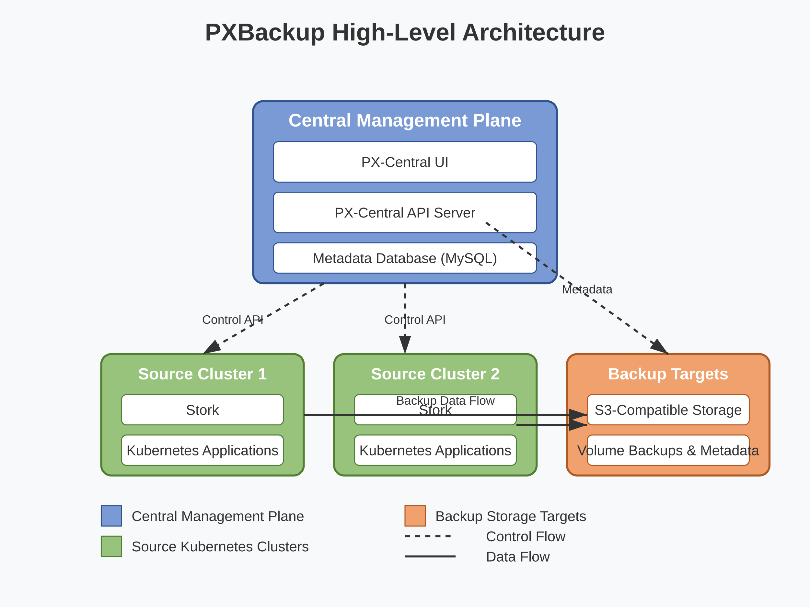
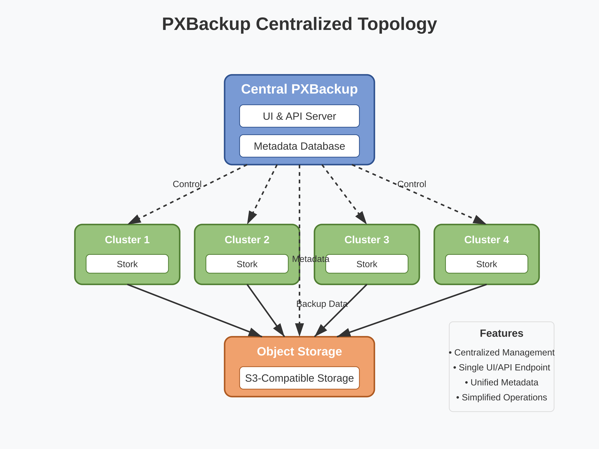
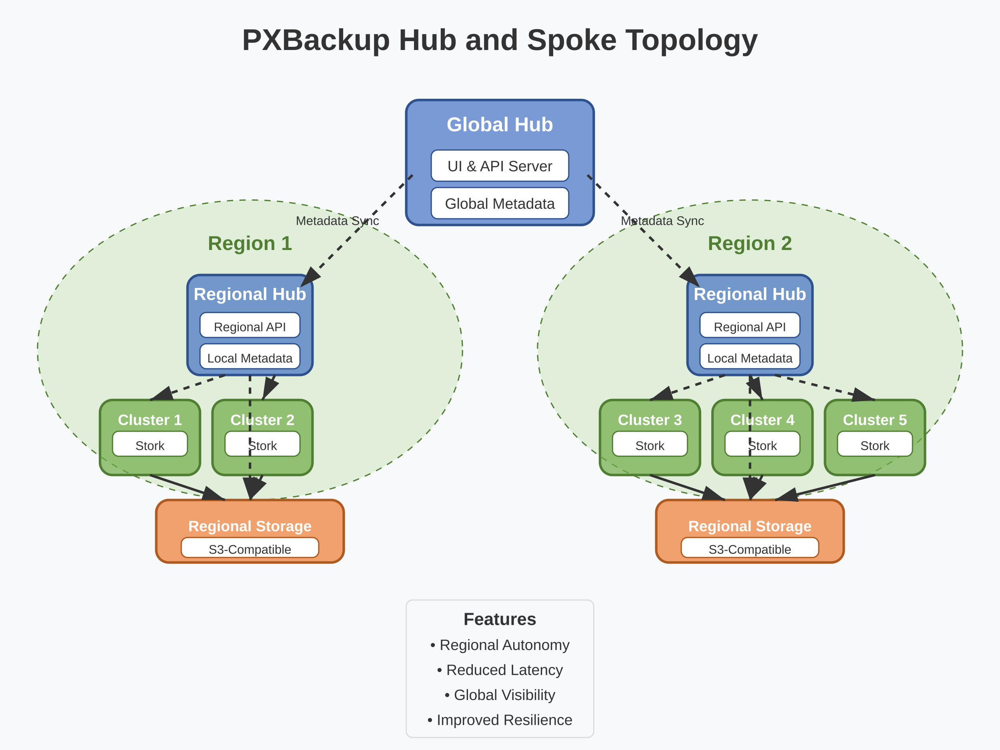
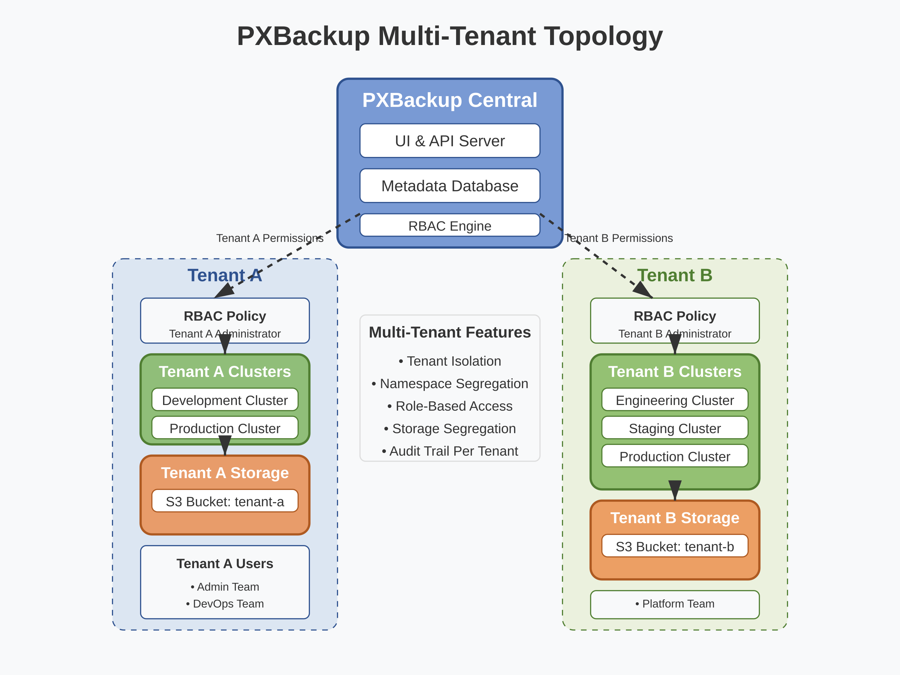

# PXBackup Architecture and Components Guide

This guide provides a detailed overview of the Portworx PXBackup architecture, its components, and how they interact in an enterprise deployment.

## Table of Contents

1. [Architecture Overview](#architecture-overview)
2. [Core Components](#core-components)
3. [Deployment Topologies](#deployment-topologies)
4. [Data Flow and Operation](#data-flow-and-operation)
5. [Scalability Considerations](#scalability-considerations)
6. [High Availability Architecture](#high-availability-architecture)
7. [Security Architecture](#security-architecture)
8. [Integration Points](#integration-points)
9. [Performance Considerations](#performance-considerations)

## Architecture Overview

PXBackup is designed as a distributed system that provides enterprise-grade backup and recovery for Kubernetes applications and data. It utilizes a central control plane and distributed data plane architecture to efficiently manage backups across multiple clusters.

### High-Level Architecture

PXBackup consists of the following high-level components:

1. **Central Management Plane**: Hosts the UI, API server, and metadata database
2. **Source Clusters**: Kubernetes clusters with applications and data to be backed up
3. **Backup Targets**: S3-compatible object storage where backups are stored
4. **Stork**: The Portworx storage orchestrator that facilitates volume snapshots and backups

## Core Components

### Central Management Components

#### PX-Central UI

- Web-based user interface for managing all PXBackup operations
- Visualizes backup status, schedules, and restore operations
- Provides dashboards for monitoring backup health and compliance
- Role-based access control for different users and teams
- Typical resource usage: 1-2 CPU cores, 2-4GB RAM

#### PX-Central API Server

- RESTful API service for programmatic control of PXBackup
- Handles authentication and authorization
- Manages cluster registrations and backup locations
- Orchestrates backup and restore operations across clusters
- Typical resource usage: 2-4 CPU cores, 4-8GB RAM

#### Metadata Database (MySQL)

- Stores backup metadata, schedules, and configuration
- Tracks backup history and status
- Maintains user accounts and RBAC information
- Requires persistent storage for durability
- Typical resource usage: 2-4 CPU cores, 4-8GB RAM, 50-100GB storage

#### Keycloak Identity Service

- Provides authentication services for PXBackup
- Integrates with enterprise identity providers via OIDC
- Manages user sessions and token issuance
- Typical resource usage: 1-2 CPU cores, 2-4GB RAM

### Data Plane Components

#### Stork

- Runs on source Kubernetes clusters
- Orchestrates application-consistent snapshots
- Coordinates backup data movement to object storage
- Manages PVC and namespace backups
- Typical resource usage: 0.5-1 CPU cores, 1-2GB RAM per cluster

#### Backup Scheduler

- Manages the execution of recurring backup schedules
- Runs on the central management plane
- Initiates backup operations based on defined schedules
- Typical resource usage: 0.5-1 CPU cores, 1GB RAM

#### Backup Executor

- Distributed component that executes backup and restore operations
- Runs on each source cluster
- Coordinates with Stork for data movement
- Typical resource usage: Variable based on backup size and concurrency

## Deployment Topologies

### Centralized Topology

In a centralized topology:
- Single PXBackup deployment manages multiple clusters
- All metadata is stored in a central database
- Simplified management and monitoring
- Best for organizations with centralized IT operations

### Hub and Spoke Topology

In a hub and spoke topology:
- Regional PXBackup deployments manage local clusters
- Federated view across all regions
- Better performance for geographically distributed clusters
- Suitable for organizations with regional IT teams

### Multi-Tenant Topology

In a multi-tenant topology:
- Single PXBackup deployment
- Logical separation between different tenants
- RBAC controls access to specific clusters and backups
- Ideal for service providers or large enterprises with multiple business units

## Data Flow and Operation

### Backup Flow

The backup process follows these steps:

1. **Initiation**:
   - User initiates backup via UI or API
   - Or scheduled backup trigger activates

2. **Metadata Creation**:
   - PXBackup central creates backup metadata record
   - Assigns unique backup ID and tracks status

3. **Resource Discovery**:
   - Stork identifies resources to be backed up
   - Determines dependencies between resources

4. **Pre-Backup Actions**:
   - Application hooks execute (if configured)
   - Resources quiesced for consistency

5. **Data Capture**:
   - For PVCs: Portworx creates volume snapshots
   - For Kubernetes resources: Manifests are exported

6. **Data Transfer**:
   - Volume data transferred to object storage
   - Kubernetes manifests stored as metadata

7. **Validation**:
   - Backup verified for completeness
   - Metadata updated with success status

8. **Cleanup**:
   - Temporary resources deleted
   - Local snapshots managed per retention policy

### Restore Flow

The restore process follows these steps:

1. **Initiation**:
   - User selects backup to restore via UI or API
   - Specifies restore parameters (namespace, transformations)

2. **Metadata Retrieval**:
   - PXBackup central retrieves backup metadata
   - Determines resources to be restored

3. **Resource Planning**:
   - Stork plans restore sequence
   - Identifies dependencies between resources

4. **Data Retrieval**:
   - Volume data retrieved from object storage
   - Kubernetes manifests downloaded

5. **Resource Creation**:
   - Kubernetes resources created in specified order
   - PVCs provisioned and data restored

6. **Post-Restore Actions**:
   - Application hooks execute (if configured)
   - Validation of restored resources

7. **Status Update**:
   - Restore status tracked and updated
   - Success or failure recorded in metadata

## Scalability Considerations

PXBackup is designed to scale across multiple dimensions:

### Vertical Scaling

- Central components can be scaled up with more CPU/memory
- Recommended for environments with many concurrent operations

### Horizontal Scaling

- API servers can be scaled horizontally for higher throughput
- UI components can be deployed behind load balancers
- Metadata database can be configured with read replicas

### Performance Scaling

The following metrics help size the PXBackup deployment:

| Metric                  | Small     | Medium    | Large     |
|-------------------------|-----------|-----------|-----------|
| Number of Clusters      | 1-5       | 6-20      | 21-50+    |
| Number of Volumes       | <500      | 500-2000  | 2000+     |
| Number of Namespaces    | <50       | 50-200    | 200+      |
| Backup Frequency        | Daily     | Hourly    | Continuous|
| Retention Period        | <30 days  | 30-90 days| 90+ days  |
| Central Node Count      | 1-3       | 3-5       | 5+        |
| Node Resources          | 4C/8G     | 8C/16G    | 16C/32G   |

## High Availability Architecture

### Component Redundancy

PXBackup provides high availability through:

1. **UI and API Server Redundancy**:
   - Multiple replicas behind load balancer
   - Stateless design allows easy scaling
   - Recommended minimum: 2 replicas

2. **Database Redundancy**:
   - MySQL with replication for failover
   - Primary-secondary configuration
   - Persistent volumes with high durability

3. **Identity Service Redundancy**:
   - Multiple Keycloak instances
   - Shared database backend
   - Session replication for failover

### Failure Domains

To protect against different types of failures:

1. **Pod-Level Failures**:
   - Component restarts handled by Kubernetes
   - Readiness/liveness probes ensure service health

2. **Node Failures**:
   - Pod anti-affinity spreads components across nodes
   - Pod disruption budgets prevent simultaneous evictions

3. **Zone Failures**:
   - Multi-zone deployment for central components
   - Database replicas spread across availability zones

4. **Complete Site Failure**:
   - Regional deployments with metadata replication
   - Backup data stored in geo-redundant object storage

## Security Architecture

### Authentication and Authorization

PXBackup implements a comprehensive security model:

1. **User Authentication**:
   - Local authentication for isolated environments
   - OIDC integration with enterprise identity providers
   - Multi-factor authentication support

2. **Authorization Model**:
   - Role-based access control for UI and API
   - Granular permissions for backups, restores, schedules
   - Namespace-level access controls
   - Cluster-level access controls

3. **API Security**:
   - TLS encryption for all communications
   - API token authentication
   - Rate limiting to prevent abuse

### Data Security

PXBackup ensures data security through:

1. **Data Encryption**:
   - In-transit encryption using TLS
   - At-rest encryption for backup data
   - Encryption key management

2. **Credential Management**:
   - Secure storage of object storage credentials
   - Kubernetes secret integration
   - Just-in-time access to sensitive data

3. **Audit and Compliance**:
   - Comprehensive audit logging
   - RBAC changes tracking
   - Backup and restore operation logging

## Integration Points

PXBackup integrates with various systems:

### Infrastructure Integration

1. **Kubernetes Integration**:
   - Native Kubernetes API integration
   - Support for multiple Kubernetes distributions
   - Custom resource definitions for backup operations

2. **Storage Integration**:
   - Portworx volume integration
   - CSI snapshot support
   - Integration with cloud provider storage

3. **Object Storage Integration**:
   - Amazon S3
   - Google Cloud Storage
   - Azure Blob Storage
   - MinIO and other S3-compatible storage

### Application Integration

1. **Pre/Post Action Hooks**:
   - Application-specific backup preparation
   - Post-backup validation
   - Pre-restore application quiescing
   - Post-restore application validation

2. **Application-Consistency**:
   - Database coordination (MySQL, PostgreSQL, MongoDB)
   - Messaging system coordination (Kafka, RabbitMQ)
   - Stateful application consistency

3. **Enterprise Integration**:
   - Monitoring systems (Prometheus, Grafana)
   - Alerting systems (AlertManager, PagerDuty)
   - CI/CD pipelines for backup validation

## Performance Considerations

### Backup Performance

Factors affecting backup performance:

1. **Volume Size and Count**:
   - Larger volumes require more time to snapshot and transfer
   - Many small volumes may require more metadata operations

2. **Network Bandwidth**:
   - Bandwidth between cluster and object storage
   - Inter-cluster communication bandwidth
   - Recommended: 10Gbps+ for production environments

3. **Object Storage Performance**:
   - Throughput and request rate limits
   - Multi-part upload capabilities
   - Regional proximity to source clusters

### Optimization Strategies

Techniques to optimize PXBackup performance:

1. **Incremental Backups**:
   - Only changed data is transferred
   - Reduces backup time and storage requirements
   - Dependent on Portworx snapshot capabilities

2. **Backup Compression**:
   - Reduces data transfer size
   - Configurable compression level
   - CPU vs. network bandwidth tradeoff

3. **Parallel Operations**:
   - Multiple volumes backed up concurrently
   - Configurable concurrency limits
   - Balance between resource usage and completion time

4. **Scheduled Distribution**:
   - Stagger backup schedules to avoid resource contention
   - Align with application usage patterns
   - Consider time zone differences in global deployments 