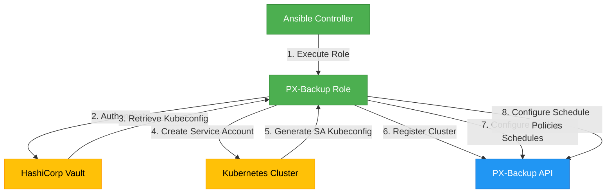
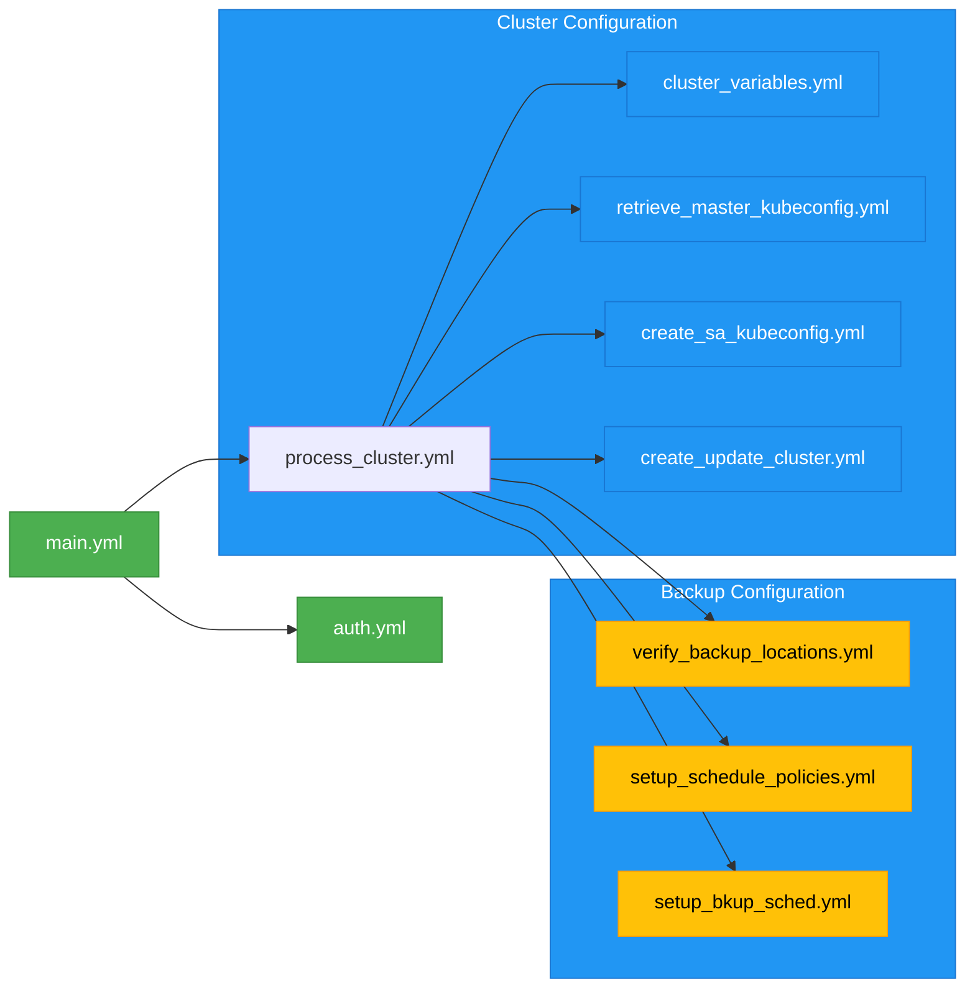
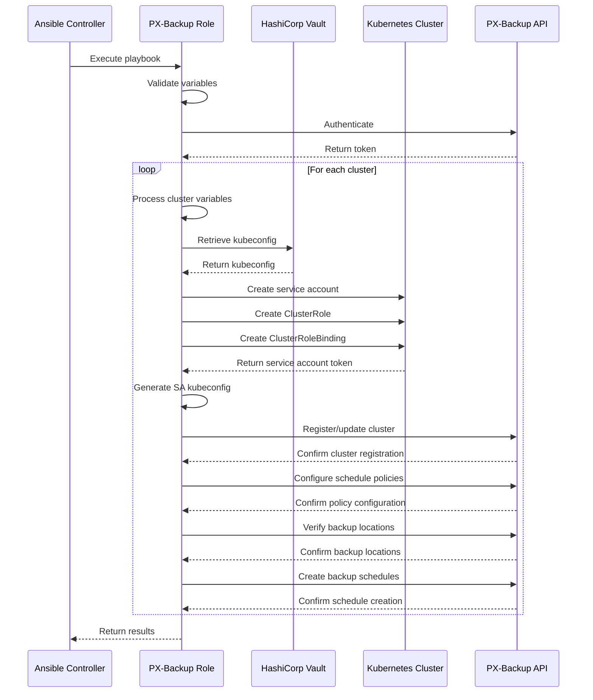
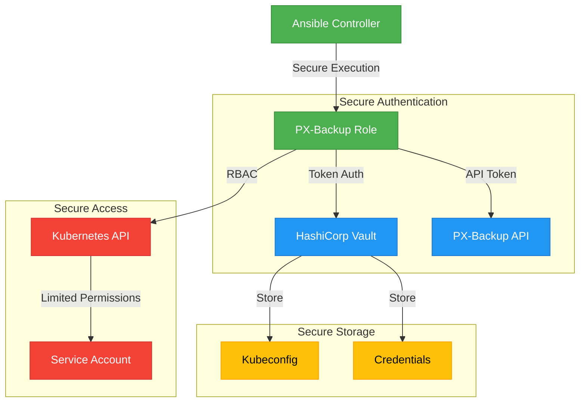
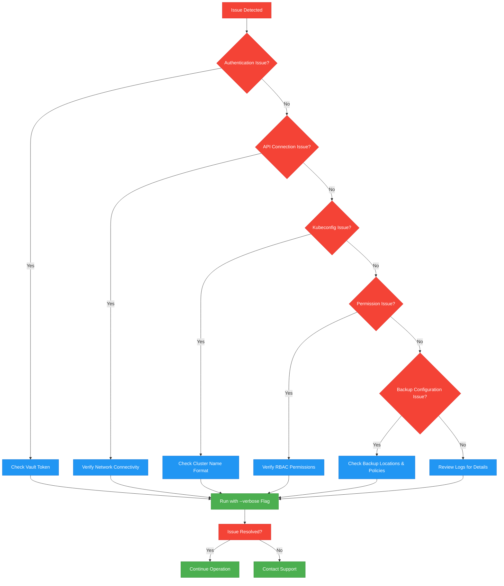

# PX-Backup Role

This Ansible role manages cluster definitions in PX-Backup using HashiCorp Vault for secure kubeconfig storage and Portworx backup API for backup operations. The role is designed to be run from ansible-runner within a container environment. For each cluster, it:

1. Validates and processes cluster variables based on naming convention
2. Retrieves kubeconfig from Vault
3. Creates a service account in the Kubernetes cluster
4. Registers the cluster with PX-Backup
5. Sets up backup schedules and policies

## Role Architecture



## Task Files

The role is structured into several task files, each handling specific aspects of PX-Backup configuration:

### Task Files Organization



### Main Task Files

- **main.yml**: Entry point for the role that validates required variables, fetches the PX-Backup token, and processes each cluster.

- **auth.yml**: Handles authentication with the PX-Backup API, validating authentication variables, requesting bearer tokens, and verifying token validity.

- **process_cluster.yml**: Orchestrates the entire cluster processing workflow, including retrieving kubeconfig, creating service accounts, and setting up backup configurations.

## Workflow Diagram



## Security Considerations

### Security Architecture



## Troubleshooting

### Common Issues

- **Authentication Failures**: Ensure your Vault token is valid and has the necessary permissions.
- **Kubeconfig Retrieval Issues**: Verify the cluster name format and Vault paths are correct.
- **API Connection Problems**: Check network connectivity to the PX-Backup API endpoint.
- **Permission Errors**: Ensure the service account has the required RBAC permissions in the cluster.
- **Schedule Policy Not Found**: Verify that the schedule policy name exists in PX-Backup before creating schedules.
- **Backup Location Not Available**: Confirm that backup locations are properly configured and accessible.

### Troubleshooting Flowchart



### Debugging Tips

- Use the `--verbose` flag with your playbook to see detailed execution information.
- Check the logs in the PX-Backup UI for API-related errors.
- Verify Vault paths and permissions if credential retrieval fails.
- Ensure the cluster is accessible from the Ansible control node.
- For authentication issues, check that the PX-Backup credentials are correct.
- When using custom service accounts, verify they have the necessary permissions.

### Validation

To validate your configuration without making any changes:

```bash
ansible-playbook playbook.yml -e @extra_vars.json --check
```

This will perform a dry run of the playbook, checking for syntax errors and validating variables without making any actual changes to the system.

## License

Apache-2.0

## Detailed Security Considerations

### Authentication and Authorization

- **PX-Backup Authentication**: Uses token-based authentication with the PX-Backup API
- **Service Account Security**: Creates dedicated service accounts with minimal permissions
- **RBAC Implementation**: Follows the principle of least privilege for all created resources
- **Token Management**: Implements proper token expiration and renewal mechanisms
- **Secure Credential Storage**: Uses Vault for storing sensitive credentials

### Vault Security

- **Token File Handling**: Validates token file permissions to prevent unauthorized access
- **Environment Isolation**: Uses environment-specific Vault paths and namespaces
- **Certificate Validation**: Implements proper SSL/TLS certificate validation
- **Secure Storage**: Stores sensitive kubeconfig data securely in Vault
- **Error Handling**: Provides comprehensive error handling for Vault operations

### Data Protection

- **Log Security**: Marks sensitive data with `no_log: true` to prevent exposure in logs
- **Temporary File Security**: Implements secure handling of temporary files
- **Cleanup Processes**: Ensures proper cleanup of sensitive data after use
- **Secure Communication**: Uses encrypted communication channels for all API interactions
- **Protected Storage**: Securely stores and retrieves kubeconfig data

### Network Security

- **SSL/TLS Verification**: Validates SSL certificates for all API communications
- **Custom CA Support**: Supports custom CA certificates for enterprise environments
- **Endpoint Validation**: Properly validates all endpoints and URLs
- **MITM Protection**: Implements protection against man-in-the-middle attacks
- **Secure Defaults**: Uses secure defaults for all network communications

### Operational Security

- **Environment Separation**: Maintains strict separation between production and non-production environments
- **Audit Logging**: Implements comprehensive audit logging for all operations
- **Error Reporting**: Provides detailed error messages and handling
- **Secure Variable Handling**: Implements secure handling of all variables
- **Configuration Validation**: Validates all configurations before execution

### Compliance Features

- **Enterprise Security**: Supports enterprise security requirements
- **Audit Trail**: Maintains audit trail for all cluster operations
- **Secret Management**: Implements secure secret management practices
- **Environment Configuration**: Supports environment-specific configurations
- **Access Control**: Implements role-based access control throughout

## Example Playbook

```yaml
---
- name: Configure PX-Backup Clusters
  hosts: localhost
  gather_facts: false
  collections:
    - community.hashi_vault
    - purepx.px_backup
    - kubernetes.core
    - ansible.utils
    - community.general
  
  roles:
    - role: pxbackup
      vars:
        # Connection Configuration
        validate_certs: true
        ca_cert_path: "/etc/ssl/certs/ca-certificates.crt"

        # PX-Backup Configuration
        px_backup_api_url: "https://pxbackup.example.com"
        pxcentral_auth_url: "https://pxbackup.example.com/auth"
        pxcentral_client_id: "px-backup-client"
        pxcentral_username: "admin"
        pxcentral_password: "{{ vault_pxcentral_password }}"
        org_id: "default"

        # Vault Configuration
        vault_token_path: "/run/secrets/vault-token"
        vault_automation_prod_address: "https://vault-prod.example.com"
        vault_automation_dev_address: "https://vault-dev.example.com"
        vault_automation_default_namespace: "automation"
        vault_automation_config_path: "kubernetes/"
        vault_automation_config_mount_point: "secret"

        # Cluster Configuration
        clusters:
          - name: "user1-platform-p-usw2a-1"
            description: "Production Cluster US West 2 Zone A"
            cloud_type: "AWS"
            px_config:
              storage_classes:
                - "portworx-db-sc"
                - "portworx-file-sc"
              namespaces:
                - "prod-apps"
                - "monitoring"
```

## Running the Role

### Using ansible-playbook

1. Direct execution with extra vars:

   ```bash
   ansible-playbook -i inventory/hosts.yml playbook.yml \
     --extra-vars "@extra_vars.json" \
     --extra-vars "validate_certs=true" \
     -v
   ```

1. Check mode (dry run):

   ```bash
   ansible-playbook -i inventory/hosts.yml playbook.yml \
     --extra-vars "@extra_vars.json" \
     --check \
     -v
   ```

1. Using vault-encrypted variables:

   ```bash
   ansible-playbook -i inventory/hosts.yml playbook.yml \
     --extra-vars "@extra_vars.json" \
     --vault-password-file /path/to/vault-password \
     -v
   ```

1. Using tags to run specific tasks:

   ```bash
   ansible-playbook -i inventory/hosts.yml playbook.yml \
     --extra-vars "@extra_vars.json" \
     --tags "cluster_setup,backup_schedules" \
     -v
   ```

### Using ansible-runner

1. Basic execution:

   ```bash
   ansible-runner run /path/to/project \
     -p playbook.yml \
     --container-runtime docker \
     -v
   ```

1. With private data directory:

   ```bash
   ansible-runner run /path/to/project \
     -p playbook.yml \
     --container-runtime docker \
     --private-data-dir /path/to/private \
     -v
   ```

1. With specific inventory:

   ```bash
   ansible-runner run /path/to/project \
     -p playbook.yml \
     --container-runtime docker \
     --inventory /path/to/inventory \
     -v
   ```

1. With environment variables:

   ```bash
   ansible-runner run /path/to/project \
     -p playbook.yml \
     --container-runtime docker \
     -e ANSIBLE_CONFIG=/path/to/ansible.cfg \
     -e ANSIBLE_VAULT_PASSWORD_FILE=/path/to/vault-password \
     -v
   ```

### Project Directory Structure for ansible-runner

```text
/path/to/project/
├── env/                    # Environment variables and settings
│   └── envvars            # Environment variables file
├── inventory/             # Inventory files
│   └── hosts.yml         # Inventory definitions
├── project/              # Project files
│   ├── roles/           # Roles directory
│   │   └── pxbackup/    # PX-Backup role
│   ├── collections/     # Collections directory
│   ├── playbook.yml    # Main playbook
│   └── extra_vars.json # Variables file
└── tmp/                 # Temporary files (created by role)
```

## Cluster Naming Convention

Clusters must follow this naming format:

```text
<cluster_user>-<platform>-<env>-<region><zone>-<id>
```

Example: `ansible-infrastructure-d-eusw1a-4`

- cluster_user: ansible
- platform: infrastructure
- env: d (dev), p (prod), t (test)
- region: eusw1
- zone: a (zone-a), b (zone-b), c (zone-c)
- id: 4

## Process Flow

1. Initial Setup and Validation:
   - Validates required variables (API URLs, credentials, org_id)
   - Checks SSL certificates and CA paths
   - Validates Vault token file existence and permissions
   - Sets up temporary directories in tmp/ for kubeconfig handling

2. Cluster Variable Processing:
   - Validates cluster name format against strict pattern
   - Parses cluster name into components (user, platform, env, region, zone)
   - Determines environment type (prod, dev, test)
   - Sets environment-specific Vault configurations
   - Retrieves cluster information from inventory service

3. Vault Integration Flow:
   - Uses ansible.builtin.stat to validate Vault token file permissions
   - Uses community.hashi_vault collection for Vault operations
   - Determines correct Vault path based on environment
   - Retrieves master kubeconfig from appropriate path
   - Handles Vault namespace and mount point selection

4. Kubernetes Resource Management:
   - Uses kubernetes.core collection for all Kubernetes operations
   - Creates dedicated namespace if not exists
   - Generates service account with minimal permissions
   - Creates role with required PX-Backup permissions
   - Sets up role bindings for proper authorization
   - Generates and validates service account token

5. PX-Backup Integration:
   - Uses purepx.px_backup collection for API interactions
   - Authenticates with PX-Backup using provided credentials
   - Validates organization access and permissions
   - Creates or updates cluster definition
   - Configures backup settings and storage classes
   - Sets up cloud provider integration if specified

6. Error Handling and Cleanup:
   - Implements proper error handling at each stage
   - Cleans up temporary files and resources
   - Provides detailed error messages and logging
   - Handles SSL/TLS verification failures
   - Manages token expiration and renewal

## Role Variables

### Required Variables

```yaml
# Connection Configuration
validate_certs: true        # Validate SSL certificates

# PX-Backup Configuration
px_backup_api_url: "https://pxbackup.example.com"  # PX-Backup API endpoint
pxcentral_auth_url: "https://pxbackup.example.com/auth"  # Auth endpoint
pxcentral_client_id: "your-client-id"  # Client ID for PX-Backup authentication
pxcentral_username: "your-username"  # Username for PX-Backup authentication
pxcentral_password: "your-password"  # Password for PX-Backup authentication
org_id: "your-org-id"  # Organization ID in PX-Backup

# Vault Configuration
vault_address: "https://vault.example.com"  # Vault server address
vault_token: "your-vault-token"  # Vault authentication token
vault_token_path: "/run/secrets/vault-token"  # Path to Vault token file
vault_automation_default_namespace: "your-namespace"  # Default Vault namespace
vault_automation_config_path: "your/config/path/"  # Path for storing kubeconfig in Vault
vault_automation_config_mount_point: "secret"  # Vault mount point for secrets

# Environment-specific Vault addresses (at least one required)
vault_automation_prod_address: "https://vault-prod.example.com"
vault_automation_dev_address: "https://vault-dev.example.com"
vault_automation_stage_address: "https://vault-stage.example.com"
vault_automation_eng_address: "https://vault-eng.example.com"

# Inventory Configuration
inventory_url: "https://inventory.example.com"  # Inventory service URL

# Clusters Configuration
clusters:
  - name: "user-platform-env-region-id"  # Required: Must follow naming convention
    description: "Production Cluster 1"   # Optional: Cluster description
    cloud_type: "AWS"                    # Optional: AWS, AZURE, GCP, or OTHER (default: OTHER)
    cloud_credential_ref: "aws-cred-1"   # Optional: Cloud provider credential reference
    platform_credential_ref: "plat-1"    # Optional: Platform credential reference
    px_config:                          # Optional: Portworx configuration
      storage_classes: ["px-ha"]        # Optional: List of storage classes
      namespaces: ["app1", "app2"]      # Optional: List of namespaces
    service_token: ""                   # Optional: Pre-existing service token
    skip_sa_creation: false             # Optional: Skip service account creation
```

### Optional Variables

```yaml
# PX-Backup Optional Configuration
token_duration: "7d"        # Token validity duration
fail_on_cluster_error: false # Whether to fail role execution on cluster error

# Vault Optional Configuration
vault_cacert_path: ""       # Path to CA certificate for Vault
vault_namespace: ""         # Enterprise Vault namespace

# Kubernetes Configuration
k8s_ns: "portworx"                            # Namespace for resources (default: portworx)
service_account_name: "pxbackup-sa"           # Service account name (default: pxbackup-sa)
cluster_role_name: "pxbackup-cluster-role"    # Cluster role name (default: pxbackup-cluster-role)
sa_role_name: "pxbackup-role"                 # Namespaced role name (default: pxbackup-role)
cluster_role_binding_name: "pxbackup-cluster-rolebinding"  # Cluster role binding name
sa_role_binding_name: "pxbackup-rolebinding"  # Role binding name

# Backup Schedule Optional Configuration
backup_type: "Normal"                # Type of backup (default: Normal)
suspend: false                       # Whether to suspend the schedule (default: false)
direct_kdmp: false                  # Use direct KDMP (default: false)
skip_vm_auto_exec_rules: false      # Skip VM auto exec rules (default: false)
parallel_backup: false              # Enable parallel backup (default: false)
keep_cr_status: false              # Keep CR status (default: false)
ns_label_selectors: {}             # Namespace label selectors
exclude_resource_types: []         # Resource types to exclude
label_selectors: {}               # Label selectors for resources
include_resources: []             # Specific resources to include
backup_object_type: ""           # Backup object type
volume_snapshot_class_mapping: {} # Volume snapshot class mapping
csi_snapshot_class_name: ""      # CSI snapshot class name
pre_exec_rule_ref: {}           # Pre-execution rule reference
post_exec_rule_ref: {}          # Post-execution rule reference
ownership: {}                   # Backup ownership configuration
```

## Directory Structure

```text
.
├── collections/          # Ansible collections directory
├── roles/               # Ansible roles directory
├── inventory/           # Inventory files
├── docs/               # Comprehensive documentation
├── tmp/                # Temporary files
├── cache/              # Cache files
└── execution-environment.yml  # Execution environment definition
```

## Tag Structure

The role uses a hierarchical tagging system to allow selective execution or skipping of specific tasks. Tags are organized into the following categories:

### Primary Functional Tags

- `cluster_setup`: Tasks related to initial cluster setup
- `cluster_management`: Tasks for creating and updating clusters in PX-Backup
- `backup_schedules`: Tasks for managing backup schedules
- `schedule_policies`: Tasks for managing schedule policies

### Operation Tags

- `api_calls`: Tasks that make API calls to external services
- `vault`: Tasks that interact with HashiCorp Vault
- `kubernetes`: Tasks that interact with Kubernetes clusters
- `validation`: Tasks that validate input data or configurations
- `reporting`: Tasks that generate reports or output results
- `debug`: Tasks that output debug information
- `error_handling`: Tasks for error handling and recovery
- `cleanup`: Tasks for cleaning up sensitive data

### Special Tags

- `always`: Critical tasks that should always run
- `variables`: Tasks that set or manipulate variables
- `security`: Tasks related to security operations

## Running the Playbook

### Basic Execution

```bash
ansible-playbook playbook.yml -e @extra_vars.json
```

### Using Tags to Select Specific Operations

```bash
# Only run cluster setup tasks
ansible-playbook playbook.yml -e @extra_vars.json --tags "cluster_setup"

# Only run schedule policy tasks
ansible-playbook playbook.yml -e @extra_vars.json --tags "schedule_policies"

# Run both cluster management and backup schedule tasks
ansible-playbook playbook.yml -e @extra_vars.json --tags "cluster_management,backup_schedules"
```

### Using Skip-Tags to Exclude Operations

```bash
# Skip backup schedule creation
ansible-playbook playbook.yml -e @extra_vars.json --skip-tags "backup_schedules"

# Skip all API calls (useful for testing)
ansible-playbook playbook.yml -e @extra_vars.json --skip-tags "api_calls"

# Skip debug output
ansible-playbook playbook.yml -e @extra_vars.json --skip-tags "debug"
```

### Common Use Cases

1. **Validate Configuration Only**:

   ```bash
   ansible-playbook playbook.yml -e @extra_vars.json --tags "validation" --check
   ```

1. **Create/Update Clusters Only**:

   ```bash
   ansible-playbook playbook.yml -e @extra_vars.json --tags "cluster_management" --skip-tags "backup_schedules,schedule_policies"
   ```

1. **Update Schedule Policies Only**:

   ```bash
   ansible-playbook playbook.yml -e @extra_vars.json --tags "schedule_policies" -e @extra_vars_schedulepolicy.json
   ```

1. **Create Backup Schedules Only**:

   ```bash
   ansible-playbook playbook.yml -e @extra_vars.json --tags "backup_schedules" --skip-tags "schedule_policies"
   ```

## Extra Variables Configuration

The role uses extra variables files to configure its behavior. These can be provided using the `-e @filename.json` parameter.

### Main Configuration (extra_vars.json)

```json
{
  "px_backup_api_url": "https://pxbackup.example.com",
  "pxcentral_auth_url": "https://pxbackup.example.com/auth",
  "pxcentral_client_id": "px-backup-client",
  "pxcentral_username": "admin",
  "pxcentral_password": "{{ vault_pxcentral_password }}",
  "org_id": "default",
  "validate_certs": true,
  
  "vault_automation_default_namespace": "automation",
  "vault_automation_config_path": "kubernetes/",
  "vault_automation_config_mount_point": "secret",
  
  "k8s_ns": "portworx",
  "service_account_name": "pxbackup-sa",
  
  "clusters": [
    {
      "name": "cluster1",
      "cloud_type": "AWS",
      "backup_schedules": [
        {
          "name": "daily-backup",
          "backup_location": "s3-backup-location",
          "schedule_policy": "daily-retention-7",
          "namespaces": ["app1", "app2"]
        }
      ]
    }
  ]
}
```

### Schedule Policies Configuration (extra_vars_schedulepolicy.json)

```json
{
  "schedule_policies": [
    {
      "name": "hourly-retention-24",
      "interval_type": "Hourly",
      "interval_count": 1,
      "retention_count": 24
    },
    {
      "name": "daily-retention-7",
      "interval_type": "Daily",
      "interval_count": 1,
      "retention_count": 7,
      "start_time": "04:00"
    },
    {
      "name": "weekly-retention-4",
      "interval_type": "Weekly",
      "interval_count": 1,
      "retention_count": 4,
      "start_time": "02:00",
      "days_of_week": ["Sunday"]
    }
  ]
}
```

## Combining Multiple Extra Variables Files

You can combine multiple extra variables files in a single playbook run:

```bash
ansible-playbook playbook.yml -e @extra_vars.json -e @extra_vars_schedulepolicy.json
